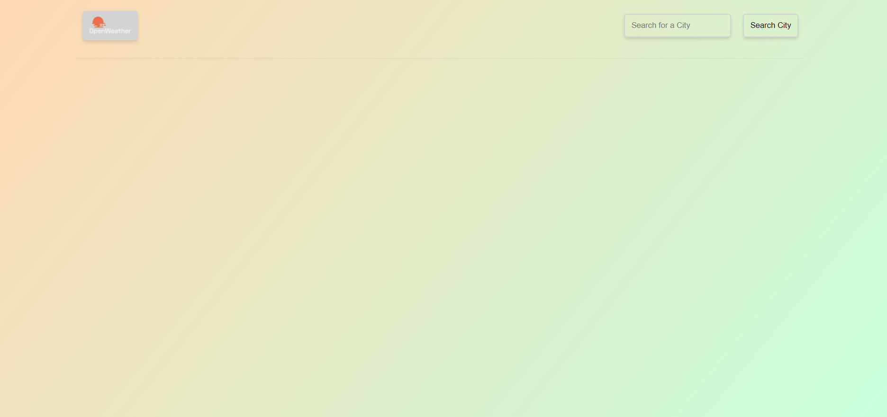

# 06 Server-Side APIs: Weather Dashboard

Homework which requires you to make a weather dashboard and save previous searches to localStorage. This app will run in the browser and will feature dynamically updated HTML and CSS powered by Styled-Components, JavaScript, and React. Technical challenges include:

- DOM manipulation
- dynamic rendered css
- React useContext
- proptypes
- Local Storage
- gh-pages publishing

Live demo found [HERE](https://sxtnkyl.github.io/06-WeatherDashboard/)!
